# terraform-azure-security-center

Production-ready Terraform module for deploying Microsoft Defender for Cloud with security contacts, auto-provisioning, per-resource pricing tiers, custom security assessments, regulatory compliance automations, integration settings, and security workflow automations.

## Architecture

```mermaid
flowchart TB
    subgraph Defender["Microsoft Defender for Cloud"]
        SC[Security Center]
        CONTACT[Security Contact]
    end

    subgraph Plans["Defender Plans"]
        P1[VirtualMachines - P2]
        P2[AppServices]
        P3[SqlServers]
        P4[StorageAccounts]
        P5[KeyVaults]
        P6[Containers]
        P7[Arm / Dns]
        P8[CloudPosture CSPM]
    end

    subgraph Settings["Integration Settings"]
        MCAS[Microsoft Cloud App Security]
        WDATP[Defender for Endpoint]
        SENT[Sentinel Onboarding]
    end

    subgraph Provisioning["Auto-Provisioning"]
        AP[Log Analytics Agent]
        VA[Vulnerability Assessment]
    end

    subgraph Assessments["Security Assessments"]
        CA1[Encryption Check]
        CA2[Network Segmentation]
        CA3[MFA Enforcement]
        CA4[Logging Validation]
    end

    subgraph Automation["Security Automations"]
        AUTO1[High Severity Alerts]
        AUTO2[Compliance Changes]
        LA[Logic App Workflow]
    end

    subgraph Workspace["Log Analytics"]
        LAW[Log Analytics Workspace]
    end

    SC --> CONTACT
    SC --> P1
    SC --> P2
    SC --> P3
    SC --> P4
    SC --> P5
    SC --> P6
    SC --> P7
    SC --> P8
    SC --> MCAS
    SC --> WDATP
    SC --> SENT
    SC --> AP
    AP --> VA
    SC --> CA1
    SC --> CA2
    SC --> CA3
    SC --> CA4
    AUTO1 --> LA
    AUTO2 --> LA
    SC --> AUTO1
    SC --> AUTO2
    AP --> LAW
    SENT --> LAW

    style SC fill:#0078D4,stroke:#005A9E,color:#fff
    style CONTACT fill:#0078D4,stroke:#005A9E,color:#fff
    style P1 fill:#DD344C,stroke:#B02A3E,color:#fff
    style P2 fill:#DD344C,stroke:#B02A3E,color:#fff
    style P3 fill:#DD344C,stroke:#B02A3E,color:#fff
    style P4 fill:#DD344C,stroke:#B02A3E,color:#fff
    style P5 fill:#DD344C,stroke:#B02A3E,color:#fff
    style P6 fill:#DD344C,stroke:#B02A3E,color:#fff
    style P7 fill:#DD344C,stroke:#B02A3E,color:#fff
    style P8 fill:#DD344C,stroke:#B02A3E,color:#fff
    style MCAS fill:#8C4FFF,stroke:#6B3AC2,color:#fff
    style WDATP fill:#8C4FFF,stroke:#6B3AC2,color:#fff
    style SENT fill:#8C4FFF,stroke:#6B3AC2,color:#fff
    style AP fill:#3F8624,stroke:#2D6119,color:#fff
    style VA fill:#3F8624,stroke:#2D6119,color:#fff
    style CA1 fill:#FF9900,stroke:#CC7A00,color:#fff
    style CA2 fill:#FF9900,stroke:#CC7A00,color:#fff
    style CA3 fill:#FF9900,stroke:#CC7A00,color:#fff
    style CA4 fill:#FF9900,stroke:#CC7A00,color:#fff
    style AUTO1 fill:#3F8624,stroke:#2D6119,color:#fff
    style AUTO2 fill:#3F8624,stroke:#2D6119,color:#fff
    style LA fill:#3F8624,stroke:#2D6119,color:#fff
    style LAW fill:#0078D4,stroke:#005A9E,color:#fff
```



## Usage

```hcl
module "security_center" {
  source = "path/to/terraform-azure-security-center"

  security_contact_email = "security@example.com"

  defender_plans = {
    "vm" = {
      resource_type = "VirtualMachines"
      tier          = "Standard"
    }
    "storage" = {
      resource_type = "StorageAccounts"
      tier          = "Standard"
    }
  }
}
```

## Examples

- [Basic](examples/basic/main.tf) - Security contact with basic Defender plans
- [Advanced](examples/advanced/main.tf) - Multiple Defender plans, workspace integration, and custom assessments
- [Complete](examples/complete/main.tf) - Full deployment with all plans, automations, Sentinel, and compliance workflows

## Requirements

| Name | Version |
|------|---------|
| [terraform](https://www.terraform.io/) | >= 1.5.0 |
| [azurerm](https://registry.terraform.io/providers/hashicorp/azurerm/latest/docs) | >= 3.80.0 |

## Resources

| Name | Type | Documentation |
|------|------|---------------|
| [azurerm_security_center_contact](https://registry.terraform.io/providers/hashicorp/azurerm/latest/docs/resources/security_center_contact) | resource | Security contact |
| [azurerm_security_center_subscription_pricing](https://registry.terraform.io/providers/hashicorp/azurerm/latest/docs/resources/security_center_subscription_pricing) | resource | Defender pricing tiers |
| [azurerm_security_center_auto_provisioning](https://registry.terraform.io/providers/hashicorp/azurerm/latest/docs/resources/security_center_auto_provisioning) | resource | Auto-provisioning |
| [azurerm_security_center_workspace](https://registry.terraform.io/providers/hashicorp/azurerm/latest/docs/resources/security_center_workspace) | resource | Workspace assignment |
| [azurerm_security_center_setting](https://registry.terraform.io/providers/hashicorp/azurerm/latest/docs/resources/security_center_setting) | resource | Integration settings |
| [azurerm_security_center_assessment_policy](https://registry.terraform.io/providers/hashicorp/azurerm/latest/docs/resources/security_center_assessment_policy) | resource | Custom assessments |
| [azurerm_security_center_automation](https://registry.terraform.io/providers/hashicorp/azurerm/latest/docs/resources/security_center_automation) | resource | Security automations |
| [azurerm_subscription](https://registry.terraform.io/providers/hashicorp/azurerm/latest/docs/data-sources/subscription) | data source | Current subscription |

## Inputs

| Name | Description | Type | Default | Required |
|------|-------------|------|---------|----------|
| security_contact_email | Security contact email | `string` | n/a | yes |
| security_contact_phone | Security contact phone | `string` | `null` | no |
| security_contact_alert_notifications | Enable alert notifications | `bool` | `true` | no |
| security_contact_alerts_to_admins | Send alerts to admins | `bool` | `true` | no |
| defender_plans | Defender plan configurations | `map(object)` | `{}` | no |
| auto_provisioning_enabled | Enable auto-provisioning | `bool` | `true` | no |
| log_analytics_workspace_id | Log Analytics workspace ID | `string` | `null` | no |
| workspace_scope | Workspace assignment scope | `string` | `null` | no |
| enable_server_vulnerability_assessment | Enable vulnerability assessment | `bool` | `false` | no |
| server_vulnerability_assessment_provider | VA provider (mdeTvm/qualys) | `string` | `"mdeTvm"` | no |
| security_assessments | Custom assessment policies | `map(object)` | `{}` | no |
| security_automations | Security workflow automations | `map(object)` | `{}` | no |
| setting_mcas_enabled | Enable MCAS integration | `bool` | `true` | no |
| setting_wdatp_enabled | Enable WDATP/MDE integration | `bool` | `true` | no |
| setting_sentinel_onboarding_enabled | Enable Sentinel onboarding | `bool` | `false` | no |
| tags | Tags for taggable resources | `map(string)` | `{}` | no |

## Outputs

| Name | Description |
|------|-------------|
| security_contact_id | Resource ID of the security contact |
| defender_plan_ids | Map of plan keys to resource IDs |
| defender_plan_resource_types | Map of plan keys to resource types and tiers |
| auto_provisioning_id | Resource ID of auto-provisioning setting |
| auto_provisioning_state | Auto-provisioning state |
| workspace_assignment_id | Resource ID of workspace assignment |
| mcas_setting_enabled | MCAS integration status |
| wdatp_setting_enabled | WDATP/MDE integration status |
| assessment_policy_ids | Map of assessment policy names to IDs |
| assessment_policy_names | Map of assessment keys to display names |
| automation_ids | Map of automation names to resource IDs |
| subscription_id | Configured subscription ID |

## License

MIT License - see [LICENSE](LICENSE) for details.
